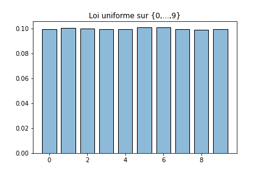
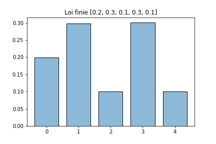
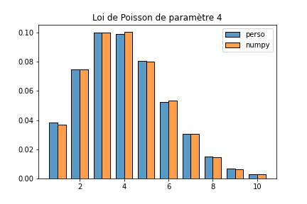

Tout le code intervenant dans cet article est disponible dans ce [notebook Jupyter](../notebooks/simulation.ipynb).

```python
from random import random
from math import floor, log, exp, factorial
```

Python dipose d'un module `random` dans la bibliothèque standard. La fonction du même nom de ce module renvoie un nombre aléatoire suivant une loi uniforme sur $[0,1[$. La variable aléatoire $U$ associée n'est pas une variable aléatoire discrète puisque son support $[0,1[$ n'est pas dénombrable. On sort donc du cadre du programme de classes préparatoires en probabilités. Néanmoins, il suffit de comprendre pour la suite que cette variable aléatoire vérifie la propriété suivante

$$
\forall(a,b)\in[0,1]^2,\;a\leq b\implies \dP(U\in[a,b[)=b-a
$$

### Loi de Bernoulli

Il est alors très simple de simuler une variable aléatoire suivant une loi de Bernoulli de paramètre $p\in[0,1]$. En effet, en posant $X=\un_{\lbrace U<p\rbrace}$, on a

$$
\begin{aligned}
\dP(X=1)&=\dP(U<p)=\dP(U\in[0,p[)=p-0=p\\
\dP(X=0)&=\dP(U\geq p)=\dP(U\in[p,1[)=1-p
\end{aligned}
$$

On peut alors définir une fonction `bernoulli` simulant une variable aléatoire de Bernoulli de paramètre $p$.

```python
def bernoulli(p):
    return 1 if random() < p else 0
```

### Loi binomiale

Comme on sait que la somme de $n$ variables aléatoires indépendantes suivant la même loi de Bernoulli de paramètre $p$ suit la loi binomiale de paramètres $n$ et $p$, il n'est alors pas difficile d'écrire une fonction simulant une variable aléatoire suivant cette loi.

```python
def binomial(n, p):
    return sum(bernoulli(p) for _ in range(n))
```

Pour vérifier que cette fonction a bien le comportement escompté, on peut comparer l'histogramme des fréquences obtenues avec notre fonction lors d'un grand nombre de simulations avec celui obtenu via la fonction `binomial` du module `numpy.random`.


### Loi uniforme

Si l'on souhaite simuler une loi uniforme sur $\lbrace0,1,\dots,n-1\rbrace$, on pose $X=\lfloor nU\rfloor$. Ainsi

$$
\begin{aligned}
\forall k\in\lbrace0,1,\dots,n-1\rbrace,\;\dP(X=k)&=\dP(\lfloor nU\rfloor=k)\\
&=\dP(nU\in[k,k+1[)\\
&=\dP\left(U\in\left[\frac{k}{n},\frac{k+1}{n}\right[\right)\\
&=\frac{k+1}{n}-\frac{k}{n}=\frac{1}{n}
\end{aligned}
$$

```python
def uniform(n):
    return floor(n*random())
```

A nouveau, on vérifie bien expérimentalement à l'aide d'un grand nombre de simulations que cette fonction simule bien une loi uniforme.



Si l'on souhaite simuler une loi uniforme sur un ensemble fini $E=\lbrace e_0,\dots,e_{n-1}\rbrace$, il suffit de modéliser cet ensemble par une liste $\mathtt{[e_0,\dots,e_{n-1}]}$.

```python
def uniform(n):
    if type(n) == int:
        return floor(n*random())
    if type(n) == list:
        return n[uniform(len(n))]
```

### Loi géométrique

On sait la loi géométrique est la loi du temps d'attente du premier succès lors de la répétition d'épreuves de Bernoulli mutuellement indépendantes. On peut donc simuler cette loi à l'aide de la fonction `bernoulli` précédement définie de la manière suivante.

```python
def geometric(p):
    n = 1
    while bernoulli(p) == 0:
        n += 1
    return n
```

Néanmoins ceci peut se révéler inefficace surtout pour de faibles valeurs de $p$ puisque le nombre d'itérations de la boucle `while` n'est pas majoré.

$$
X=\left\lfloor\frac{\ln(1-U)}{\ln(1-p)}\right\rfloor+1
$$

$$
\begin{aligned}
\forall n\in\dN^*,\;\dP(X=n)&=\dP\left(\left\lfloor\frac{\ln(1-U)}{\ln(1-p)}\right\rfloor=n-1\right)\\
&=\dP\left(n-1\leq\frac{\ln(1-U)}{\ln(1-p)}<n\right)\\
&=\dP\left(n\ln q<\ln(1-U)\leq(n-1)\ln q\right) \qquad\text{car }\ln q\leq0\\
&=\dP\left(q^n<1-U\leq q^{n-1}\right)\\
&=\dP\left(U\in\left[1-q^{n-1},1-q^n\right[\right)\\
&=q^{n-1}-q^n=q^{n-1}p
\end{aligned}
$$

Remarquons que si $X$ suit la loi géométrique de paramètre $n$, alors en notant classiquement $q=1-p$ :

$$
\forall n\in\dN,\;\dP(X\leq n)=\sum_{k=1}^nq^{k-1}p=p\cdot\frac{1-q^n}{1-q}=1-q^n
$$

```python
def geometric(p):
    return floor(log(1-random())/log(1-p))+1
```

A nouveau, on peut comparer l'histogramme des fréquences obtenues avec notre fonction avec celui obtenu avec la fonction `geometric` du module `numpy.random`.


### Loi à support fini

On souhaite simuler une variable aléatoire $X$ de loi suivante :

$$
\forall k\in\lbrace0,\dots,n-1\rbrace,\;\dP(X=k)=p_k
$$

---

**Proposition.** Soit $(p_0,\dots,p_{n-1})$ une famille de termes positifs et de somme $1$. On note

$$
\forall k\in\lbrace0,\dots,n-1\rbrace,\;S_k=\sum_{j=0}^kp_k
$$

et on convient que $S_{-1}=0$. Alors si $U$ suit une loi uniforme sur $[0,1[$ et si

$$
X=\inf\left\lbrace k\in\lbrace0,\dots,n-1\rbrace,\;U<S_n\right\rbrace
$$

alors $\dP(X=k)=p_n$ pour tout $k\in\lbrace0,\dots,n-1\rbrace$.

_Preuve._ Il suffit de remarquer que

$$
\begin{aligned}
\forall k\in\lbrace0,\dots,n-1\rbrace,\;\dP(X=k)&=\dP(S_{k-1}\leq U<S_k)\\
&=\dP(U\in[S_{k-1},S_k[)\\
&=S_k-S_{k-1}=p_k
\end{aligned}
$$

---

On en déduit l'algorithme suivant où `proba` désigne une liste de réels positifs de somme 1.

```python
def fini(proba):
    r = random()
    s = sum(proba)
    sp = proba[0]
    n = 0
    while r >= sp:
        n += 1
        sp += proba[n]
    return n
```

Mais si jamais l'utilisateur ne fournit pas une liste de réels de somme 1, on peut normaliser les éléments de cette liste.

```python
def fini(proba):
    r = random()
    s = sum(proba)
    sp = proba[0]/s
    n = 0
    while r >= sp:
        n += 1
        sp += proba[n]/s
    return n
```

On vérifie encore une fois expérimentalement la correction de cette fonction.



### Loi à support dénombrable

On souhaite simuler une variable aléatoire $X$ de loi suivante :

$$
\forall k\in\dN,\;\dP(X=n)=p_n
$$

---

**Proposition.** Soit $\sum_{n\in\dN}p_n$ une série à termes positifs et de somme $1$. On note

$$
\forall n\in\dN,\;S_n=\sum_{k=0}^np_k
$$

sa somme partielle de rang $n$ et on convient que $S_{-1}=0$. Alors si $U$ suit une loi uniforme sur $[0,1[$ et si

$$
X=\inf\lbrace n\in\dN,\;U<S_n\rbrace
$$

alors $\dP(X=n)=p_n$ pour tout $n\in\dN$.

_Preuve._ Il suffit de remarquer que

$$
\forall n\in\dN,\;\dP(X=n)=\dP(S_{n-1}\leq U<S_n)=\dP(U\in[S_{n-1},S_n[)=S_n-S_{n-1}=p_n
$$

---

On en déduit l'algorithme suivant où `proba` désigne une fonction prenant en argument un entier naturel $n$ et renvoyant un réel $p_n$ tel que $\sum_{n\in\dN}p_n$ soit une série de terme positifs et de somme 1.

```python
def infini(proba):
    r = random()
    n = 0
    s = proba(0)
    while r >= s:
        n += 1
        s += proba(n)
    return n
```

Par exemple, si la fonction `poisson` suivante simule une variable aléatoire de paramètre `l` donné.

```python
poisson=lambda l: infini(lambda n: exp(-l)*l**n/factorial(n))
```


